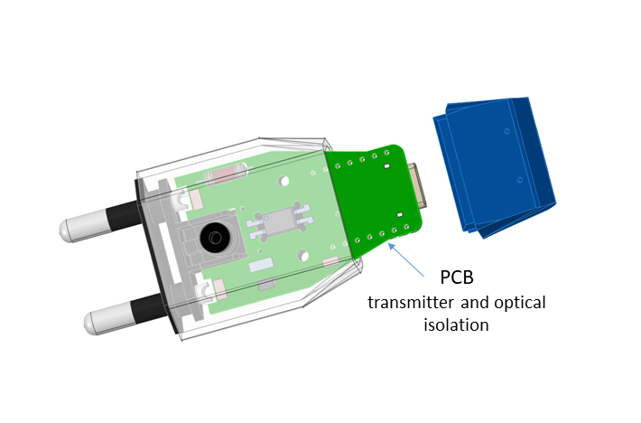

# AC-Analyzer Frequency-Monitoring- with- programming
Analyze AC frequency, send high precision results over USB (serial).    
Build averages or out of range indicators. Check for power outages, brown outs etc. Measure anywhere you see a wall socket or outlet.

Works an any device that can do USB serial (Win, Linux, Android, Raspy etc.)

## Security
AC-Analyzer is designed to comply with VDE distance regulations. Anything possible was done to stay secure. However, this devices works with life-endangering voltages. Do not even think to use it when you are untrained and/or have no experience with high voltages or not the needed equipment for secure usage. Usage is at your own risk.

## Description
Welcome to the AC-Analyzer AC Mains Frequency Measurement project! We features a compact and efficient PCB designed to integrate the ESP super mini microcontroller, enabling precise measurement of AC mains frequency. 

Whether you're an electronics hobbyist, a professional developer, or an educational institution, this project provides a versatile platform for exploring AC frequency measurement and monitoring. Join us in innovating smarter solutions for today's energy management needs!

Made for:

**IoT Developers:** Companies or developers focused on IoT solutions may find it useful for applications in energy monitoring, smart home devices, or industrial automation.

**Electrical Engineers:** Professionals involved in electrical engineering could use the AC Analyzer for research, development, and testing of power systems or frequency monitoring devices.

**Renewable Energy Sector:** Businesses or individuals in solar power, wind energy, or other renewable sources may use this technology to monitor the frequency of generated AC power.

**Building Automation Companies:** Companies that specialize in building management systems could integrate this PCB for better control and monitoring of electrical systems.

**Educational Institutions:** Schools and universities that teach electronics or electrical engineering could use this as a teaching tool for students to learn about AC frequency measurement and IoT applications.

**Home Appliance Manufacturers:** Companies that produce smart appliances might incorporate this technology for better energy efficiency and monitoring.

**Energy Management Firms:** Organizations focusing on energy efficiency and consumption analysis might utilize the PCB for data collection and analysis.

**Electronics Hobbyists and Makers:** If you are an experienced electrician and interested in DIY electronics projects might be keen on using such a PCB for home automation or monitoring systems.
