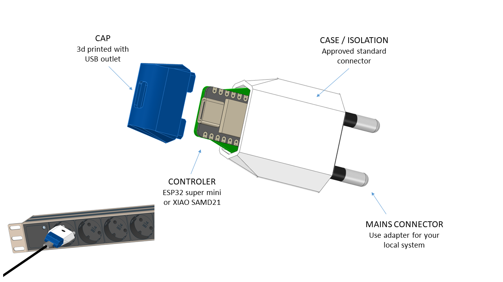

# AC-Frequency-Monitoring-PCB-with-ESP-Super-Mini
Analyze AC frequency, send high precision results over USB (serial).    

## Description
Welcome to the ESP Super Mini PCB: AC Mains Frequency Measurement project! We features a compact and efficient PCB designed to integrate the ESP super mini microcontroller, enabling precise measurement of AC mains frequency. 

Whether you're an electronics hobbyist, a professional developer, or an educational institution, this project provides a versatile platform for exploring AC frequency measurement and IoT technologies. Join us in innovating smarter solutions for today's energy management needs!

## Security
AC-Analyzer is designed to comply with VDE distance regulations. Anything possible was done to stay secure. However, this devices works with life-endangering voltages. Do not even think to use it when you are untrained and/or have no experience with high voltages. Useage is at your own risk.

